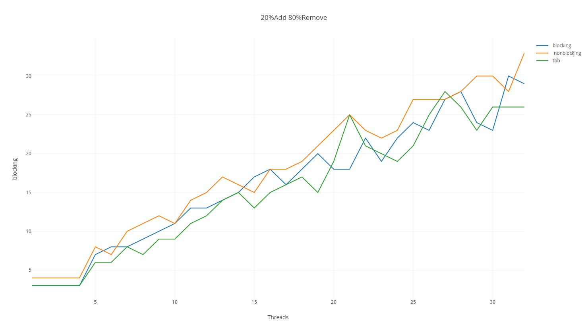
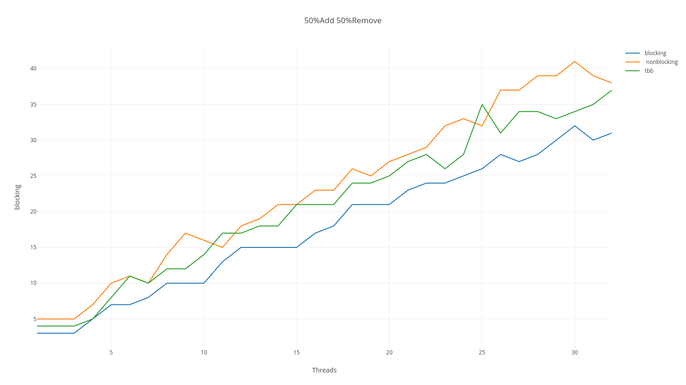
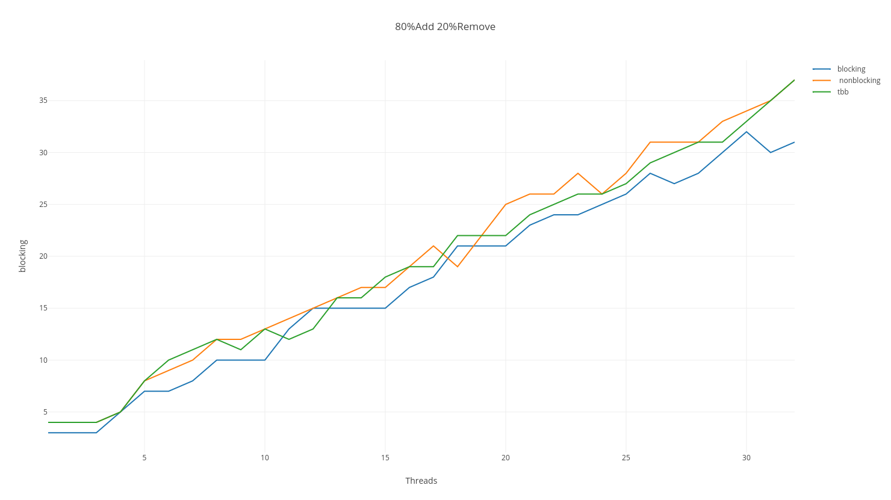

# The circular array based concurrent total queue

### Methodology
Both Blocking Queue and Non-Blocking Queue are total queue, which means add() and remove() do not wait certain conditions
to be true. A add() call that tries to add an item to a full pool immediately returns a failure code. A remove() call that 
tries to remove an item from an empty pool immediately returns a failure code.
#### Correctness
##### Blocking Queue
Blocking Queue uses *enqLock* and *deqLock* to lock head and tail respectively. Only one thread can preform add operation 
or remove operation. In the case that one thread is preforming add() and one thread is preforming remove(), since add() and remove() 
only modify tail or head respectively, they can be linearized at either the end of first if statement or the end of method.
Both the add() and remove() methods are total as they do not wait for the queue to become empty or full.
The add() only uses *enqlock* and the remove() only uses *deqlock*, so this queue cannot deadlock.

##### Non-Blocking Queue
Non-Blocking Queue uses three indices: head indicates head position, tail indicates ultimate tail position, tailCommit
indicates current available position to be read(remove). In the case that tailCommit is behind tail, it means some add()
method reserved slot for adding, but have not added item to queue yet.
All three indices increase logically in manner of tail is always larger than tailCommit and tailCommit is always larger 
then head. In that event that some of them circular reset to the beginning, they still cannot surpass the other index. e.g.
tail resets to 1 and head is 2(queue is full), tail cannot be larger than or equals to 2(the first if statement in add() ensures this).
###### Add(): 
If tail+ 1 == head(linearization point), the queue is full. 
If the queue is not full, the add() reserves a slot first then insert the item, then move tailCommit(linearization point). The reservation is done
by a CAS operation. If this CAS succeed, the slot is reversed. If the CAS fails, it means other add() already reserved the slot. Multiple threads can
insert item to queue, but they increase tailCommit in STRICT order(smaller tail index commit first). This ensures data saved in a slot is fully committed
before allowing a remove() to remove it from queue.
###### Remove():
If tail == head(linearization point), the queue is empty. 
If the queue is not empty, assign current head item to result. The next CAS operation ensures head haven't been moved by other remove(). If the CAS 
succeed(linearization point), move head to next position. If the CAS fails, it means other remove() already removed the item in that slot.

##### ABA Problem
ABA problem only happens during CAS, and only matters for non-primitive data type. Because this implementation only use primitive data(int) during CAS,
ABA problem is irrelevant in this implementation. Moreover, because all three indices increase logically(explained in non-blocking queue section),
ABA can never happen.

#### Efficiency
The blocking queue has high contention on head and tail. Only one thread can perform add() or remove() at a time, so efficiency should be low 
on this implementation, However, the benchmark contradicts my expectation. 1) The implementation could be wrong. 2) Because it is total queue,
methods exit immediately when condition fail.  
In non-blocking queue, because the second CAS(), it put all add() operations in busy waiting, and remove() is depended on add()'s completion. Atomic operations
take more time to finish. This may be the reason that non-blocking queue does not outperform blocking in benchmark.

#### Difficulties
  * To build a non-blocking queue, essentially we need to assign content and move index and perform these two operations in
one atomic step. This is not possible for DAS.
  * Queue only has two access point(head,tail), so it has large contention in both position. It is hard to solve.
  * To argue the correctness. Even if I believe I build a correct data structure, I cannot build test cases to verify it.
  * To debug a concurrent data structure.

### Benchmark
Measure execution time for 1 thread to 32 threads. 
For each thread, it performs total **50000** operations and capacity of queue is set to **10000**. 
All tests are performed in Ubuntu VM environment. 
Three different profile
  * 20% add(), 80% remove()
   
  * 50% add(), 50% remove()
   
  * 80% add(), 20% remove()
   

### Test Benchmark Building Instruction
#### Windows
	Use Visual Studio

#### Linux

##### Install Intel&reg; Threading Building Blocks 
	sudo apt-get install libtbb-dev

##### Change Profiles
	Modify #define field in main.cpp

##### Compile
	g++ -std=c++11 -o main main.cpp NONBLOCKING_QUEUE.h BLOCKING_QUEUE.h TestBuilder.h -ltbb -pthread

### Run
	./main